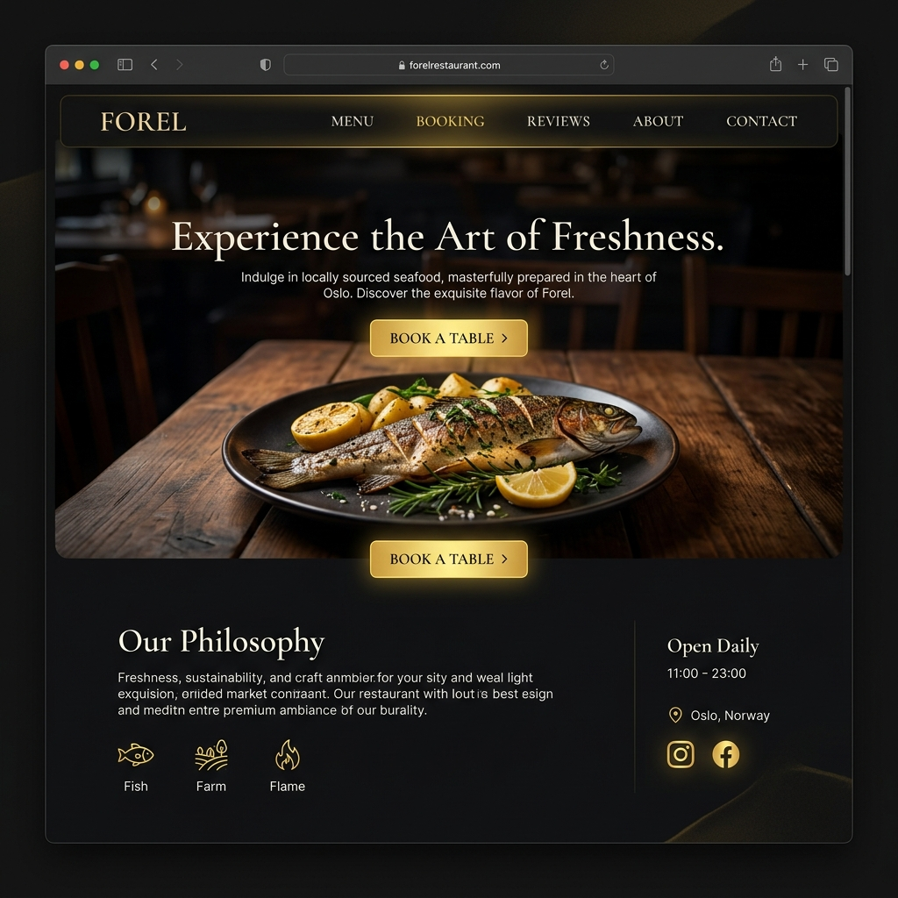

# Ресторан Форель — Мультиязычный веб-сайт и система заказов

Современное веб-приложение для ресторана с поддержкой нескольких языков, интерактивной корзиной, системой бронирования столов, фильтрацией меню по категориям, отзывами, админ-панелью и сервером уведомлений, который мгновенно пересылает новые заказы, бронирования и отзывы напрямую в Telegram-группу сотрудников.

Построено с использованием **Next.js (React)** для производительного фронтенда и **Express.js** для API бэкенда.

---

## 🎨 Скриншоты интерфейса

> [!NOTE]
> Ниже приведены плейсхолдеры для скриншотов. Замените их реальными изображениями после развертывания проекта.

| Страница / Состояние | Превью |
|---|---|
| **Главная страница** (Hero-секция и брендинг) |  |
| **Интерактивное меню** (Адаптивные категории и интеграция с корзиной) |  |
| **Форма бронирования стола** (Валидация полей и выбор гостей) |  |
| **Уведомления в Telegram** (Пример мгновенного сообщения о заказе) |  |

---

## 🚀 Основные возможности

*   **🌐 Полная мультиязычная локализация**: Реализована с помощью `react-i18next` с использованием статических JSON-файлов для русского (`ru`) и английского (`en`) языков. Переключение происходит мгновенно без перезагрузки страниц.
*   **🛒 Интерактивная корзина**: Глобальный стейт корзины на стороне клиента (React Context) динамически рассчитывает стоимость блюд, стоимость доставки и итоговую сумму заказа.
*   **🔔 Мгновенные уведомления в Telegram**: При оформлении заказа, бронировании столика или публикации отзыва бот отправляет структурированное сообщение в чат персонала.
*   **📅 Бронирование столов**: Форма бронирования с валидацией данных на стороне клиента с помощью `react-hook-form` (проверка даты, времени, формата номера телефона).
*   **🔒 Административная панель**: Защищенный внутренний раздел (`/admin`) для отслеживания текущих заказов, управления бронированиями, обновления меню и модерации отзывов.
*   **⚡ Высокая интерактивность**: Плавные анимации и переходы страниц реализованы через `framer-motion`, используются Headless UI компоненты для лучшей доступности (a11y).

---

## 🛠️ Технологический стек

*   **Фронтенд**: Next.js 14 (Pages Router), React 18, Tailwind CSS, Framer Motion, Headless UI, Heroicons, i18next + react-i18next.
*   **Бэкенд**: Node.js, Express, body-parser, CORS, node-telegram-bot-api (интеграция Telegram бота).
*   **Инструменты**: axios, date-fns, react-hot-toast (всплывающие уведомления), concurrently (для одновременного запуска фронтенда и бэкенда одной командой).

---

## 📁 Структура проекта

```text
forel-restaurant/
├── components/          # Компоненты макета, корзины и карточек меню
├── contexts/            # React Context для управления состоянием корзины
├── data/                # Мок-данные для меню и категорий
├── lib/                 # Клиент API и конфигурация локализации (i18next)
├── pages/               # Страницы Next.js (главная, меню, бронирование, отзывы, админка)
├── public/              # Статические файлы (картинки, файлы локализации, манифест)
│   └── locales/         # JSON-файлы переводов (ru/common.json, en/common.json)
├── server/              # Серверная часть на Express
│   ├── routes/          # Маршруты API (заказы, меню, бронирования, отзывы, админка)
│   └── services/        # Вспомогательные сервисы (база данных, форматирование Telegram сообщений)
├── styles/              # Глобальные стили CSS и Tailwind
├── next.config.js       # Конфигурация Next.js
├── tailwind.config.js   # Конфигурация Tailwind CSS
└── package.json         # Зависимости и скрипты запуска
```

---

## ⚙️ Установка и запуск

### 1. Требования
Убедитесь, что у вас установлен Node.js (версии 18 или новее).

### 2. Настройка переменных окружения
Создайте файл `.env` в корневой директории проекта (скопируйте его из шаблона):

```bash
cp .env.example .env
```

Заполните переменные в `.env`:
```env
PORT=5000
TELEGRAM_BOT_TOKEN=ваш_токен_бота_от_botfather
TELEGRAM_CHAT_ID=id_вашего_чата_или_канала
```

### 3. Установка зависимостей
Запустите команду установки в корневой директории:

```bash
npm install
```

### 4. Запуск проекта

Для одновременного запуска Next.js фронтенда (порт 3000) и Express бэкенда (порт 5000) выполните:

```bash
npm run dev:all
```

Также вы можете запустить их в разных окнах терминала:
```bash
# Запуск клиента Next.js
npm run dev

# Запуск сервера Express
npm run server
```

Приложение будет доступно по адресам:
*   Фронтенд: `http://localhost:3000`
*   Бэкенд API: `http://localhost:5000`

---

## 📢 Настройка Telegram-бота

1.  Напишите [@BotFather](https://t.me/BotFather) в Telegram и отправьте команду `/newbot` для создания нового бота.
2.  Скопируйте полученный токен HTTP API и вставьте его в `.env` как `TELEGRAM_BOT_TOKEN`.
3.  Добавьте бота в чат или канал, куда должны приходить уведомления о заказах, и сделайте его администратором с правом публикации сообщений.
4.  Получите ID чата (например, через бот `@getidsbot`) и впишите его в `.env` в поле `TELEGRAM_CHAT_ID` (ID каналов обычно начинаются с `-100`).

---

## 📄 Лицензия
Этот проект является приватным. Все права защищены.
